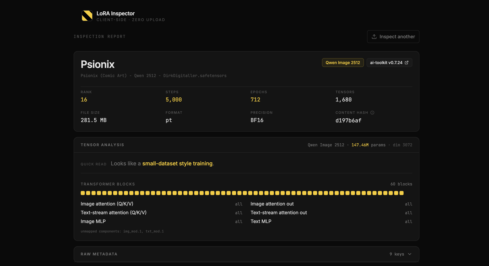

# LoRA Inspector

Drop a `.safetensors` file. See what's inside. Runs entirely in your browser.

→ **Try it: https://omervaner.github.io/lora-inspector/**



LoRA Inspector reads the metadata header and tensor index of a LoRA `.safetensors` file and renders a clean breakdown: training stats, model architecture, block-level coverage, and the raw metadata. It never uploads the file — parsing happens locally using `File.slice()` on just the header bytes.

Useful for figuring out which LoRA in your folder was the good one, checking what a Civitai download actually trained, or comparing two checkpoints before keeping the latest.

## Privacy

Everything runs client-side. Your LoRAs never leave your machine, never touch a server, never get logged. The page works fully offline once loaded — you can verify in the Network tab that nothing fires when you drop a file.

## What it shows

**Identity** — name, base model, file size, content hash, trainer name and version.

**Training stats** — rank, total steps, epochs, tensor count, precision.

**Tensor analysis** — model architecture, parameter count, block-level coverage strip showing which transformer blocks have LoRA weights, and a breakdown by component (image attention, text attention, MLPs).

**Raw metadata** — the unmodified safetensors header, for the metadata-curious.

**Tensor index** — full list of every tensor in the file with shape and dtype, for the deeply curious.

## Supported architectures

- FLUX.1 (dev / schnell)
- FLUX.2 (dev / Klein 9B)
- Qwen Image (2512)

Other architectures still load and display — anything the inspector doesn't have a layout map for shows up under "unmapped components" in the tensor analysis, with everything else intact in the raw views.

## Tech

React + TypeScript + Vite + Tailwind. shadcn/ui for primitives. No backend, no analytics, no telemetry. Static site, hosted on GitHub Pages.

The safetensors parser reads only the 8-byte header length and the JSON header that follows it — tensor weights are never loaded. A 6 GB LoRA parses in milliseconds.

## Run locally

```bash
git clone https://github.com/omervaner/lora-inspector.git
cd lora-inspector
npm install
npm run dev
```

## Other projects

Things I make:

- **[Lookout](https://github.com/omervaner/SqlVersionControl)** — a SQL IDE that doesn't suck.
- **[MediaHive](https://github.com/omervaner/MediaHive)** — visual media browser.

## License

MIT.
